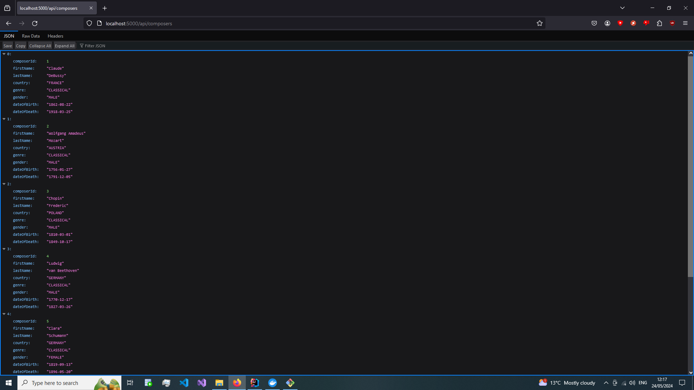
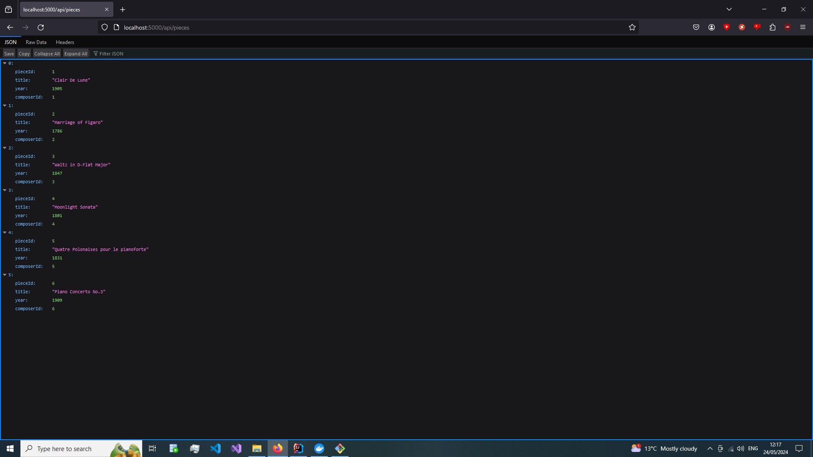

# This is the information page for my Spring Boot Application

## Project Description
This project is an application made in the Spring Boot Framework for the Java Programming language.
It is a REST API using the CRUD repository format. The API handles data on piano composers and various pieces
attributed to them. It uses MariaDB as its database, in this case, held in a separate Docker container, mapped to
local port 3306. The application itself is hosted at localhost on Port 5000.

## Running the Project
Steps:
- Download [Docker](https://www.docker.com/products/docker-desktop/) for using the MariaDB container.
- Run the Docker Compose file using ```docker-compose up -d``` in the terminal.
- For Windows, run the Application in Intellij or using ```.\mvnw spring-boot:run``` from terminal where pom.xml is located.
- If using a Linux based System, use ./ for Bash terminals instead of .\ to run the script. ```./mvnw spring-voot:run```
- When the project is running, visit [Localhost](http://localhost:5000/api/composers) to start viewing some already
seeded data on composers. Alternatively, visit [Localhost](http://localhost:5000/api/pieces) to view the compositions
already available in the system.
- The HTTP file accompanying this project in the main directory can be used to view requests being sent to interact
with the system.
Testing API interactions can be done using the HTTP file if your environment allows for running it. If not, the Bash
script included can be called using ```./testEndpoints.sh```

### Results
When viewed, the browser displays the following:



## What I've learned
- The Spring Boot Framework(Annotations, etc.)
- Optionals in Java
- Records in Java
- How to hide Easter eggs in your API.
- Writing a Bash script to test the API endpoints.
- Java Jakarta validation library.
- Convention over Configuration layouts.
- Spring Boot Database Integration in this case, MariaDB.
- Application Properties - [Spring Boot Documentation](https://docs.spring.io/spring-boot/docs/current/reference/html/application-properties.html)